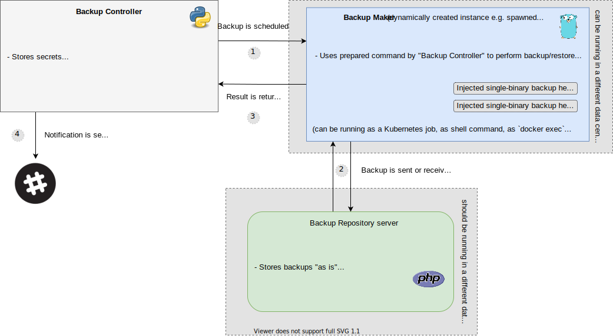

Backup Controller
=================

WIP: Note this project is a work in progress



Backups made easy, automated, monitored and SECURED with an audited encryption.

Schedules backup tasks executed by `Backup Maker`, uploaded to `Backup Repository` server.

**TLDR:** Downloads required tools, creates temporary PODS, temporary containers, spawns `backup-maker` process and notifies about the result.

```bash
# common flows
bahub :backup:make my_db
bahub :backup:restore my_db --version=v1
bahub :backup:restore my_db # latest

# inline docs
bahub :help:info               # Lists all built-in backup types and transports
bahub :help:transport:example  # Shows example transport configuration for given transport
bahub :help:backup:example     # Shows a example configuration for a given backup type
```

```yaml
accesses:
    my_local_instance:
        url: "http://localhost:8000"
        token: "${API_TOKEN}"  # example of reading a variable from ENVIRONMENT

encryption:
    my_key_pair_one:
        private_key_path: "../backup-maker/resources/test/gpg-key.asc"
        public_key_path: ""
        passphrase: "riotkit"
        email: "bakunin@example.org"

transports:
    my_docker_mysql_container:
        type: bahub.transports.docker  # Please notice: Transport name is a Python package path, unofficial transports are welcome!
        spec:
            container: "bahub_adapter_integrations_db_mysql_1"

backups:
    # ===
    #   list of backups - name: settings
    #   usage: bahub :backup:make db_mysql_something
    # ===
    db_mysql_something:
        # ===
        #   Metadata for backup definition, wires backup settings with those abstractions:
        #     encryption: How to encrypt your data
        #     access: How to access Backup Repository server (JWT token, url)
        #     collection_id: Where to place data on Backup Repository server (need to create a collection and copy it's id)
        #     transport: Where to run backup - "in a Docker container?", "in Kubernetes kind: Job?", "with kubectl exec?", "with docker exec?", "through ssh?"
        #
        #   Notice: Metadata is mostly a reference to globally defined settings in this YAML document
        # ===
        meta:
            type: bahub.adapters.mysql   # Please notice: This is a Python package path, unofficial adapters are welcome!
            access: my_local_instance    # Please notice: You can make backup to different remote servers
            encryption: my_key_pair_one  # Please notice: You can encrypt with different keys as you wish
            collection_id: "11111-2222-33333-4444" # collection id created on Backup Repository server (optional when saving backup to file only)
            transport: my_docker_mysql_container  # Please notice: You can execute the backup EVERYWHERE
            
        # ===
        #  "spec" section contains INPUT PARAMETERS to adapter, in this example to "bahub.adapters.mysql"
        #  You can implement your adapter and use it there.
        # ===
        spec:
            host: "my-database-host.local"
            port: 3306
            user: "root"
            password: "root"
            #database: "example" # when "database" is not specified, the all databases will be dumped
```

**Features:**
- **End-To-End encryption** using GNU Privacy Guard, you can store your backups on a remote server that will not know what you store. We use GPG as it is audited and trusted.
- Natively sends backups to **Backup Repository server**
- Backups made with just a one **simple** command `bahub :backup:make my-db`
- Restoring is as simple as backup `bahub :backup:restore my-db`
- **Does not require additional disk space to store backup**, the backup is done on-the-fly
- **Natively supports Docker**, including databases running in Docker
- **Natively supports Kubernetes** by running backup commands as jobs or by running commands in application pods
- Understands what is to back up by using native methods such as `mysqldump`, `pg_dump` and others depending on what application is it. You specify only if it is e.g. PostgreSQL and what are the credentials.
- Supports "offline backup" of Docker containers by turning them off, then copying the data
- Slack/Mattermost notifications about successes and failures
- Errors monitoring with Sentry.io support

**Abstract architecture:**
- Adapters like `mysql`, `postgres_dump`, `filesystem` are defining how to properly do your backup, there can be many more adapters, even made by external people all around the world
- Transports: We support executing backup in `sh` (local shell), `docker` (docker container), `sidedocker` (offline, copying files of other docker container), but feel free to write your own transport or use transport written by other people. There are many possibilities such as enabling `SSH`, `Kubernetes`, `ECS` and more.
- Decoupled: `Backup Controller` is scheduling backups, while `Backup Maker` is actually performing backup & encryption & sending. `Backup Controler` takes care to spawn `Backup Maker` always close to the application data, even if there are multiple data centers.

**Extensible:**
- Although we do not support currently remote backups via SSH it does not mean that it is impossible - `Backup Controller` is extensible, everyone can write an adapter that will enable `ECS`, `Docker Swarm`, `SSH`
  or any other transport that can run commands and return output
- `Backup Controller` can use backup adapters and command transports that are placed in other Python packages, so **any unofficial adapters and transports are easily pluggable!**

Requirements
------------

- Linux machine when installed directly on host machine, any other os if running on Docker (including Windows)
- Python 3.9 (if you cannot afford to install it on your old CentOS, then use Docker)
- MySQL client tools (if going to backup & restore MySQL databases)
- PostgreSQL client tools (if going to backup & restore PostgreSQL databases)
- GNU tar
- GNU Privacy Guard 2.x (mandatory, for E2E encryption support. There is no way to turn off encryption)

Installing
----------

a) via Python package (on host machine)

```bash
pip install bahub
```

b) via Docker (in a container)

```bash
# todo
```

c) using Helm in Kubernetes

```bash
# todo
```

Development
-----------

```bash
export RKD_SYS_LOG_LEVEL=debug
python -m bahub -rl debug :SOME-TASK-HERE --config=./bahub.conf.yaml
```

Usage with Kubernetes
---------------------

### Side pod (temporary pod)

Given your application is marked with `app=nginx` label in `default` namespace, then a temporary pod that will use same volumes as original pod
will be spawned with image `ghcr.io/riotkit-org/backup-maker-env:latest` for maximum amount of `300 seconds`.

`scaleDown` additionally scales down original POD for backup time, after backup is finished the original POD is restored to previous state.

**Hint:** *Scale down services, where is no native backup method, so a filesystem adapter must be used. For example a mysql or postgresql backup using dumping method does not require scaling of the database pods, but copying /var/lib/mysql or /var/lib/postgresql would require pod scaling*

```yaml
transports:
    kubernetes_pod_fs:
        type: bahub.transports.kubernetes_sidepod
        spec:
            namespace: default
            selector: "app=nginx"
            image: "ghcr.io/riotkit-org/backup-maker-env:latest"
            timeout: 300
            scaleDown: true

backups:
    fs_kubernetes_pod:
        meta:
            type: bahub.adapters.filesystem
            access: secured
            encryption: strong
            collection_id: "${TEST_COLLECTION_ID}"  # environment variable, can be an explicit value instead
            transport: kubernetes_pod_fs
        spec:
            paths:
                - /var/www
```

```bash
backup-controller :backup:make fs_kubernetes_pod
```

### Pod exec `kubectl exec` like

With this method backup is performed inside application pod.

Makes a `kubectl exec`-like operation into a POD labelled with `app=nginx` to perform a backup.

```yaml
transports:
    kubernetes_pod_fs:
        type: bahub.transports.kubernetes_podexec
        spec:
            namespace: default
            selector: "app=nginx"

backups:
    fs_kubernetes_pod:
        meta:
            type: bahub.adapters.filesystem
            access: secured
            encryption: strong
            collection_id: "11111-2222-3333-4444"
            transport: kubernetes_pod_fs
        spec:
            paths:
                - /var/www
```

Automatic generated documentation/examples
------------------------------------------

```bash
# see list of built-in adapters (backup types) and transports
backup-controller :help:info

# see example snippet for transport "bahub.transports.docker_sidecontainer"
backup-controller :help:transport:example bahub.transports.docker_sidecontainer

# see example snippet for backup type (adapter)
backup-controller :help:backup:example bahub.adapters.mysql
```


## Contributing

Contributions are welcome. We are looking for co-maintainers due to fact that we maintain a lot of projects simultaneously.

### Environment

To setup project you need to use `pipenv`.

```bash
pipenv install
pipenv shell

# inside Pipenv's shell
export PYTHONPATH=$(pwd)
pytest --disable-pytest-warnings .  # run all tests
KEEP_CLUSTER=yes pytest . --disable-pytest-warnings -k TestKubernetesTransport -s  # run Kubernetes integration tests
```

### Committing

Please follow [Conventional Commits](https://www.conventionalcommits.org/en/v1.0.0/) guideline, additionally please
add issue or pull request number.

**Examples:**
- `fix: #161 pod container status were not checked before attempt to execute a command in container`
- `feat: #1312 implement ssh transport`
